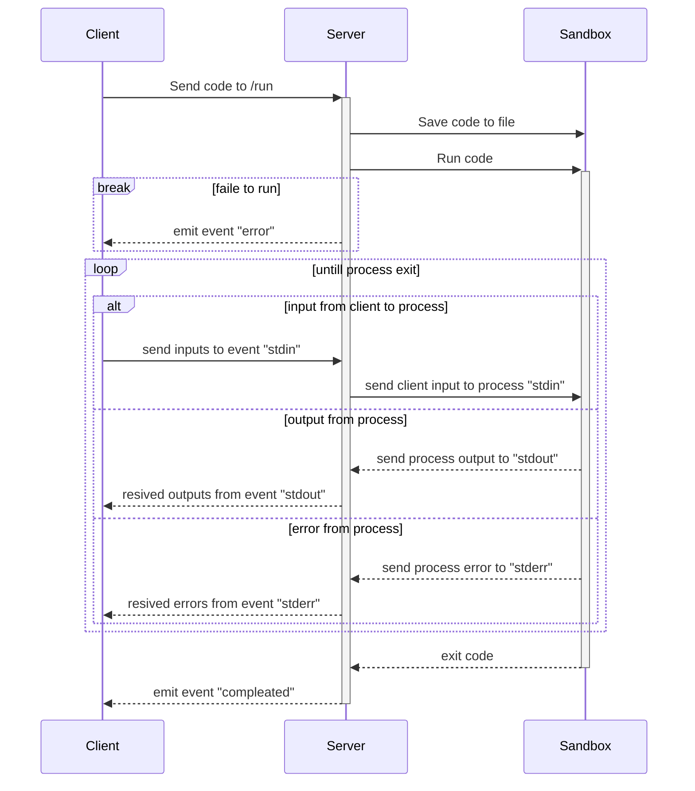

# Design

## Flow to run code

แผนภาพแสดงลำดับเหตุการณ์ของระบบ Code Runner Service

ในขั้นตอนการรันโค้ด โดยอันดับแรก เมื่อไคลเอนต์ส่งโค้ดไปยังเซิร์ฟเวอร์ แล้วเซิร์ฟเวอร์จะทำการบันทึกโค้ดลงในไฟล์ เพื่อให้เซิร์ฟเวอร์รันโค้ดในสภาพแวดล้อมจำลองได้ แต่หากโค้ดไม่สามารถรันได้ เซิร์ฟเวอร์จะส่งเหตุการณ์ "error" กลับไปให้ผู้ใช้ได้รับทราบ มิฉะนั้น เซิร์ฟเวอร์จะรอรับส่ง อินพุท เอาพุท และ ข้อผิดพลาด ไปกลับระหว่างผู้ใช้ และสภาพแวดล้อมจำลอง จนกว่าโปรแกรมจะทำงานจบหลังจากนั้นเซิร์ฟเวอร์จะส่งเหตุการณ์ "completed" เพื่อแจ้งให้ผู้ใช้ได้รับทราบว่าโปรแกรมทำงานเสร็จสิ้นแล้ว
